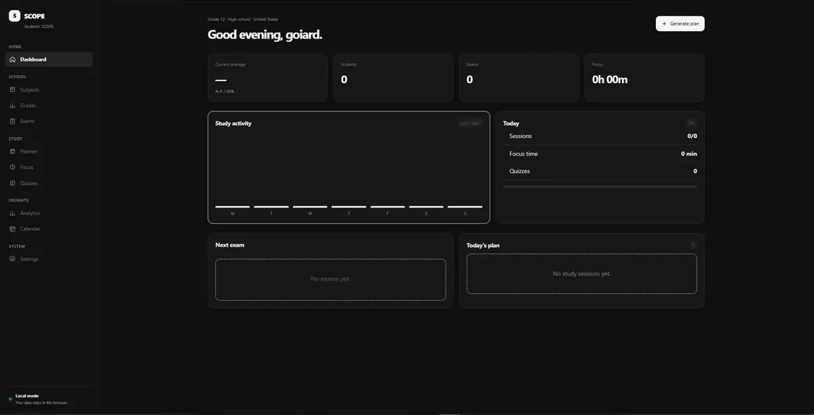

# SCOPE

<div align="left">

### 🎓 A focused workspace for students

# Plan school. Track progress. Study with purpose.

**A clean, local-first workspace for grades, exams, planning, focus and insights.**

[](LICENSE)
[](#-built-with)
[](#-privacy-first)
[](#-github-pages)

<a href="#-features">Features</a>
&nbsp;·&nbsp;
<a href="#-privacy-first">Privacy</a>
&nbsp;·&nbsp;
<a href="#-run-locally">Run locally</a>
&nbsp;·&nbsp;
<a href="#-contributing">Contributing</a>

</div>

<br>



## ✨ Overview

SCOPE brings the parts of student life that usually live across different apps into one clean workspace.

Track grades, prepare for exams, plan study sessions, run focus timers and understand your progress — all from a lightweight browser app.

**No account. No subscription. No backend. Just your workspace.**

## 🧩 Features

| | Feature | |
|---|---|---|
| 📊 | **Dashboard** | Your average, exams, study activity and daily plan at a glance |
| 📚 | **Subjects** | Courses, teachers and target grades |
| 📝 | **Grades** | Grade tracking and weighted averages |
| 📅 | **Exams** | Upcoming assessments and difficulty |
| 🗓️ | **Planner** | Structured study sessions around your topics |
| ⏱️ | **Focus** | Pomodoro, Deep Work and 52/17 sessions |
| 🧠 | **Quizzes** | Practice-set and quiz tracking |
| 📈 | **Analytics** | Focus time, completion and subject performance |
| 🗓️ | **Calendar** | Exams and study sessions in a monthly view |
| 🌍 | **Profiles** | Country, school type and year settings |
| 🌓 | **Themes** | Light and dark mode |
| 💾 | **Data tools** | Export, import and reset your workspace |

## 🔒 Privacy first

SCOPE is designed **local-first**.

- 🔐 Academic data stays in your browser.
- 🚫 There is no SCOPE backend collecting your data.
- 💾 Export your workspace as JSON at any time.
- ♻️ Import a backup to restore your data.
- ⚠️ Browser storage can still be cleared, so keep a backup of important data.

## 🛠️ Built with

- **HTML5** — semantic structure
- **CSS3** — responsive UI, animations and themes
- **Vanilla JavaScript** — application logic without a framework
- **localStorage** — local-first persistence
- **GitHub Actions** — automated static deployment

> Zero build step. Zero package manager. Zero unnecessary dependencies.

## 🚀 Run locally

```bash
git clone https://github.com/goiard/scope.git
cd scope
python -m http.server 8080
```

Then open **http://localhost:8080**.

A local HTTP server is recommended for development, although `index.html` can also be opened directly.

## 🌐 GitHub Pages

SCOPE includes a GitHub Actions workflow for static GitHub Pages deployment.

Enable it in:

**Settings → Pages → Build and deployment → Source → GitHub Actions**

Once Pages is enabled, pushes to `main` deploy automatically.

## 📁 Project structure

```text
scope/
├── assets/
│   ├── dashboard-preview.webp
│   └── icon.svg
├── css/
│   └── style.css
├── js/
│   └── app.js
├── .github/
│   └── workflows/
│       └── pages.yml
├── index.html
├── manifest.webmanifest
├── LICENSE
└── README.md
```

## 🎯 Design principles

SCOPE deliberately stays simple.

- Keep dependencies close to zero.
- Make important information visible immediately.
- Prefer clean, predictable interactions.
- Use semantic and accessible controls.
- Keep academic data local by default.
- Avoid unnecessary visual noise.
- Keep the interface fast on lower-end devices.
- Respect reduced-motion preferences.

## 🤝 Contributing

Contributions are welcome.

1. Fork the repository.
2. Create a focused branch.
3. Make a small, coherent change.
4. Test on desktop and mobile.
5. Check the UI in a current Chromium, Firefox or Safari browser.
6. Open a pull request with a concise explanation.

## 📄 License

SCOPE is licensed under the **MIT License**.

Copyright © 2026 goiard.

---

<div align="center">

**Built for students who want less clutter and more focus.**

⭐ If you like SCOPE, consider giving the repository a star.

</div>
